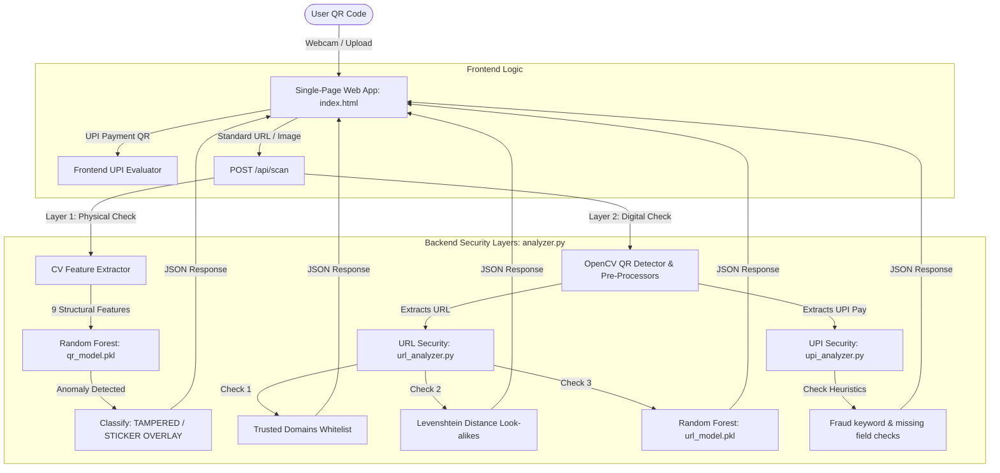

# Quishy | Anti-Phishing QR Code Security System

🚀 **Live Demo:** [quishy.onrender.com](https://quishy.onrender.com/)

**Quishy** is a smart, two-layer anti-phishing security application designed to analyze QR codes. It detects both **physical tampering** (such as malicious sticker overlays pasted over genuine QR codes) and **digital threats** (malicious URLs, phishing sites, and fraudulent UPI payment requests). 

The project consists of a Python Flask backend powered by computer vision (OpenCV) and Machine Learning (Random Forest Classifiers), coupled with a beautiful, responsive dark-mode single-page frontend.

---

## 🚀 Key Features

- **Double-Layer QR Validation**:
  - **Physical Check**: Extracts 9 structural and visual features (pixel symmetry, variance, contours, Canny edge density, and Laplacian blurriness) to classify whether the QR code is genuine or a sticker overlay.
  - **Digital Check**: Decodes the embedded QR content and subjects it to advanced security analysis.
- **Smart URL Defense**:
  - **Whitelist Check**: Verifies URLs against a trusted database of domains.
  - **Typosquatting Protection**: Computes the **Levenshtein Distance** between the query domain and trusted brands to catch visual look-alike domains (e.g., `g00gle.com` instead of `google.com`).
  - **Machine Learning Analysis**: Classifies URL safety using a trained classifier based on string features like Shannon entropy, digit ratio, and suspicious keywords.
  - **Protocol Security**: Enforces HTTPS and blocks dangerous protocol smuggling (e.g., `javascript:`, `data:`).
- **UPI Payment Protection**:
  - Intercepts UPI payment URIs (`upi://pay`).
  - Extracts and displays key fields: Payee Name, UPI ID, Amount, Note, and Provider.
  - Runs heuristics to flag missing names, malformed IDs, and social-engineering keywords (e.g., `cashback`, `refund`, `winner`, `lucky`).
- **Interactive UI**:
  - Drag-and-drop QR image uploader.
  - Built-in webcam QR scanning utilizing `jsQR`.
  - Detailed scan result cards, warnings, and safe badges.

---

## 🏗️ System Architecture



---

## 📁 Repository Structure

```text
qr-phishing-detection/
├── run.py                 # Flask server entrypoint (runs debug server)
├── requirements.txt       # Python package dependencies
├── app/
│   ├── __init__.py        # Flask app configuration and upload folder setup
│   ├── routes.py          # API endpoints (GET/POST / and POST /api/scan)
│   └── templates/
│       └── index.html     # Single-page frontend app (HTML/CSS/JS)
├── utils/
│   ├── analyzer.py        # Orchestrates the 2-layer scanning workflow
│   ├── qr_features.py     # Extracts 9 visual & structural features from QR images
│   ├── upi_analyzer.py    # Rule-engine and handle checker for UPI pay URIs
│   ├── url_analyzer.py    # URL whitelist, Levenshtein, and ML analyzer
│   └── url_features.py    # Computes 17 features (entropy, len, etc.) for URL ML model
├── models/
│   ├── qr_model.pkl       # Pre-trained Random Forest model for physical sticker anomaly
│   └── model.pkl          # Pre-trained Random Forest model for digital URL phishing
├── scripts/
│   ├── train_model.py     # Random Forest training script for physical QR features
│   └── train_url_model.py # Random Forest training script for URL features
├── data/
│   └── url_dataset/
│       └── [Book1]extra_safe_url # Local database of trusted domains
└── tests/
    └── test_upi_analyzer.py      # Unit tests for the UPI rules engine
```

---

## 🛠️ Setup & Installation

### Prerequisites
- Python 3.9+
- A webcam (optional, for browser camera scanning)

### 1. Clone the Repository
```bash
git clone https://github.com/mamboo108/qr-phishing-detection.git
cd qr-phishing-detection
```

### 2. Set Up virtual environment
```bash
# On Windows
python -m venv venv
.\venv\Scripts\Activate.ps1

# On macOS/Linux
python3 -m venv venv
source venv/bin/activate
```

### 3. Install Dependencies
```bash
pip install -r requirements.txt
```

### 4. Fix Configuration & Run
Before running, check the **Important Bug Fixes** section below to ensure the Machine Learning checks run correctly.
```bash
python run.py
```
Open your browser and navigate to `http://127.0.0.1:5000`.

---

## ⚠️ Important Implementation Notes & Resolved Bugs

### 1. Model Filename Mismatch (Resolved)
* **Status: FIXED.** Previously, [utils/url_analyzer.py](file:///c:/projects/qr-phishing-detection/utils/url_analyzer.py) attempted to load `models/url_model.pkl`, but the file was named `model.pkl` in the repository. This caused the digital ML classifier check to be bypassed. The file has now been renamed to `url_model.pkl`, enabling full machine learning-based URL analysis.

### 2. Unused Template Route (Resolved)
* **Status: FIXED.** The legacy POST `/` route handler inside [app/routes.py](file:///c:/projects/qr-phishing-detection/app/routes.py) which attempted to render a non-existent `result.html` template has been safely removed. The root route now handles only `GET` requests to load the single-page application (`index.html`).

### 3. Missing Training Datasets (Information)
* **The Issue:** The training scripts in the `scripts/` folder (`train_model.py` and `train_url_model.py`) reference local CSV files such as `safe_urls.csv`, `phishing_urls.csv`, and `qr_features.csv`. These datasets are not committed to the repository. While the pre-trained model files are fully functional, you will need to provide your own CSV datasets if you wish to retrain the classifiers.

---

## 🛠️ Technologies Used

- **Backend Framework**: [Flask](https://flask.palletsprojects.com/)
- **Computer Vision**: [OpenCV (cv2)](https://opencv.org/)
- **Machine Learning**: [scikit-learn](https://scikit-learn.org/) (Random Forest Classifiers), [Pandas](https://pandas.pydata.org/), [NumPy](https://numpy.org/)
- **Algorithms**: [Levenshtein Distance](https://github.com/ztane/python-Levenshtein) (Visual look-alike matching), Shannon Entropy (Domain randomness)
- **Frontend**: [jsQR](https://github.com/cozmo/jsQR) (browser-based webcam QR reader), Vanilla HTML5/CSS3/JS
- **Testing**: Python `unittest` library
